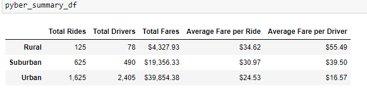

# PyBer Analysis

Data Analysist for PyBer, a ride sharing app company.

## Overview of the Project:

### Project Background:

The purpose of this analysis is o perform exploratory analysis on data in some very large csv files.  Several types of visulaizations are created to tell a story about the data. Python scripts using Pandas library, Jupyter notebook, and Matplotlib are written to create a variety of charts to showcase the relationship between:
- The type of city and number of drivers 
- Riders as well as the percentage of total fares 
- Riders and drivers by the type of city

The analysis and visualizations you create will help PyBer improve access to ride sharing services and determine the affordability for under served neighborhoods. 

### Purpose:
Perform new analyses:

- A ride-sharing summary DataFrame by city type 
- A multiple-line chart that shows the total weekly fares for each city type  

## Resources
Data Source:
[city_data.csv](Resources/city_data.csv)
[ride_data.csv](Resources/ride_data.csv)

Software: Pythn 3.6.1, Pandas, Matplotlib, Jupyter notebook

## Analyses and Results:

For this analyses, Python code [PyBer_Challenge.pynb](/PyBer_Challenge.pynb)

Total Rides was the highest in the urban setting, followed by Suburban then by Rural.
Total Drivers was the highest in the urban setting, followed by Suburban then by Rural.
Total Fares collected was in the urban setting, followed by Suburban then by Rural.
Average Fare per Ride highest in the Rural area, followed by Suburban then by Urban
Average Fare per Driver was in the urban setting, followed by Suburban then by Rural.

## Summary:

Three business recommendations to the CEO for addressing any disparities among the city types.
- Increase the number of drivers in the Rural area
- Decrease the fare per ride in the Rural area
- Inrease the number of drivers in the Suburban area

